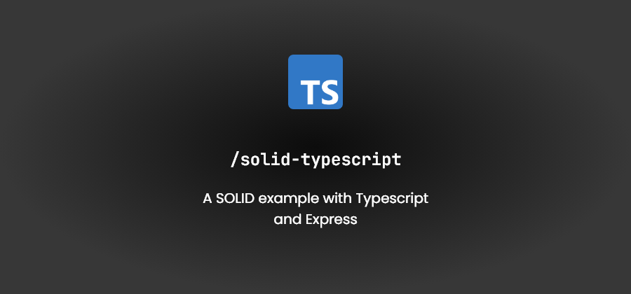

<h2 align="center">
  Typescript SOLID
</h2>

  A SOLID implementation in Typescript.

## Pre-requisites

- [Pnpm](https://pnpm.js.org/)
- [Node.js](https://nodejs.org/)

## 🚀 How to execute

- Clone the repository
- Install the dependencies with pnpm
- Initialize the offline server with pnpm start
- Now you can access the endpoints of your application at localhost:3333 of your browser.

## :memo: License

This project is licensed under the MIT License, so feel free to use it for any purpose.
